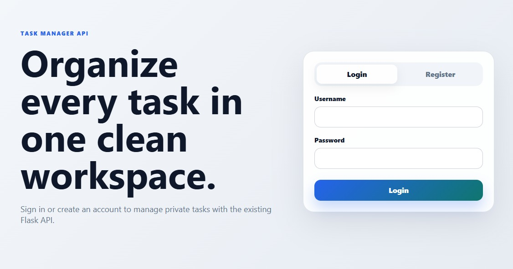

# Task Manager API

A full-stack task manager project with a Flask/SQLite backend and a React/Vite frontend.

The backend lets users register, log in, receive a JWT access token, and perform CRUD operations only on tasks that belong to their own account.

## Live Demo

* Frontend application: https://task-manager-frontend-pkip.onrender.com/
* Backend API: https://task-manager-api-yossi.onrender.com
* API documentation (Swagger UI): https://task-manager-api-yossi.onrender.com/docs

> The frontend and backend are deployed as separate Render services. Depending on the service state, the first request may take some time.

## Application Preview



## Features

* User registration and login
* Secure password hashing
* JWT authentication, logout, and token revocation
* User-owned task CRUD operations
* Task filtering by status and category
* Interactive Swagger/OpenAPI documentation
* Automated backend tests with pytest
* React frontend built with Vite
* Deployed React frontend and Flask API on Render

## Technologies

* Python, Flask, SQLite, Flask-JWT-Extended, python-dotenv
* Flask-Swagger-UI, OpenAPI 3.0
* pytest, Gunicorn, Render
* React, Vite, ESLint
* Git and GitHub

## Project Structure

```text
task-manager-api/
|-- .codex/
|   `-- skills/
|       `-- safe-frontend-change/
|           |-- agents/
|           |   `-- openai.yaml
|           `-- SKILL.md
|-- backend/
|   |-- app/
|   |   |-- __init__.py
|   |   |-- auth_routes.py
|   |   |-- database.py
|   |   |-- jwt_handlers.py
|   |   |-- main_routes.py
|   |   `-- task_routes.py
|   |-- tests/
|   |   |-- conftest.py
|   |   |-- test_auth.py
|   |   |-- test_jwt.py
|   |   |-- test_main.py
|   |   `-- test_tasks.py
|   |-- .env.example
|   |-- app.py
|   |-- openapi.yaml
|   |-- requests.http
|   |-- requirements.txt
|   `-- wsgi.py
|-- frontend/
|   |-- public/
|   |-- src/
|   |   |-- assets/
|   |   |-- App.css
|   |   |-- App.jsx
|   |   |-- index.css
|   |   `-- main.jsx
|   |-- package.json
|   `-- vite.config.js
|-- .gitignore
|-- AGENTS.md
`-- README.md
```

## Backend Architecture

The backend uses the Flask application factory pattern.

The `create_app()` function:

* Creates and configures the Flask application
* Loads the JWT secret key
* Registers the authentication and task blueprints
* Registers JWT error handlers
* Initializes the SQLite database
* Serves the OpenAPI specification
* Configures Swagger UI

The backend is divided into separate modules for authentication, task management, database access, JWT handling, and general routes.

## Backend Installation

Clone the repository and enter it:

```bash
git clone https://github.com/yossichakim/task-manager-api.git
cd task-manager-api
```

Create and activate a virtual environment from the repository root:

```bash
python -m venv venv
```

Windows Command Prompt:

```bash
venv\Scripts\activate
```

Windows PowerShell:

```powershell
venv\Scripts\Activate.ps1
```

macOS or Linux:

```bash
source venv/bin/activate
```

Install backend dependencies from `backend/`:

```bash
cd backend
python -m pip install -r requirements.txt
```

## Environment Variables

The backend example configuration is available at `backend/.env.example`. For local backend development, create `backend/.env`:

```env
JWT_SECRET_KEY=your-secure-secret-key
FRONTEND_URL=http://localhost:5173
```

`JWT_SECRET_KEY` is required and is used to sign JWT access tokens.

`FRONTEND_URL` controls the additional frontend origin allowed by the backend CORS configuration. The local Vite origin, `http://localhost:5173`, is already allowed by the backend. In production, set `FRONTEND_URL` to the deployed frontend origin:

```env
FRONTEND_URL=https://task-manager-frontend-pkip.onrender.com
```

Generate a secure secret key with:

```bash
python -c "import secrets; print(secrets.token_hex(32))"
```

Copy the generated value into the `.env` file.

The frontend reads its API base URL from `VITE_API_BASE_URL`. For a production build, set this variable in `frontend/.env.production` or in the frontend deployment environment:

```env
VITE_API_BASE_URL=https://task-manager-api-yossi.onrender.com
```

The repository does not include a frontend `.env.example` file. Do not commit `.env` files or secrets to GitHub.

## Database

The backend uses SQLite. The database and its required tables are initialized automatically when the Flask application starts.

No manual database setup command is required.

The main tables are:

* `users`: `id`, `username`, `password_hash`
* `tasks`: `id`, `title`, `description`, `category`, `status`, `user_id`
* `revoked_tokens`: `id`, `jti`, `revoked_at`

Each task is connected to the user who created it.

The `revoked_tokens` table stores JWT identifiers after logout so that revoked access tokens cannot be reused.

## Run Backend Locally

Start the development server from `backend/`:

```bash
cd backend
python app.py
```

The API will be available at:

```text
http://127.0.0.1:5000
```

Swagger UI will be available at:

```text
http://127.0.0.1:5000/docs
```

## Production Entry Point

The production deployment uses Gunicorn and the WSGI entry point from `backend/`:

```bash
cd backend
gunicorn wsgi:app
```

The `backend/wsgi.py` file creates the Flask application instance used by the production server.

## Frontend

The backend must also be running during local frontend development.

Install frontend dependencies from `frontend/`:

```bash
cd frontend
npm install
```

Run the frontend development server:

```bash
npm run dev
```

The Vite development server proxies `/register`, `/login`, `/logout`, and `/tasks` requests to `http://127.0.0.1:5000`, as configured in `frontend/vite.config.js`.

For a production frontend build, configure the deployed backend URL:

```env
VITE_API_BASE_URL=https://task-manager-api-yossi.onrender.com
```

This value can be provided through `frontend/.env.production` or the frontend deployment environment.

## Frontend Validation

Run the configured frontend lint and production build commands:

```bash
cd frontend
npm run lint
npm run build
```

The repository does not currently include an automated frontend test suite.

## API Documentation

The API is documented using OpenAPI 3.0 and Swagger UI.

Local documentation:

```text
http://127.0.0.1:5000/docs
```

Production documentation:

```text
https://task-manager-api-yossi.onrender.com/docs
```

The OpenAPI specification is available at:

```text
/openapi.yaml
```

## Authentication

Protected endpoints require a JWT access token.

After logging in, include the token in the request header:

```http
Authorization: Bearer <access_token>
```

In Swagger UI:

1. Register a user with `POST /register`
2. Log in with `POST /login`
3. Copy the returned access token
4. Click `Authorize`
5. Paste the token
6. Execute protected task endpoints

Swagger automatically adds the `Bearer` prefix.

## API Endpoints

| Method | Endpoint           | Authentication | Description                             |
| ------ | ------------------ | -------------: | --------------------------------------- |
| GET    | `/`                |             No | Check API status                        |
| GET    | `/about`           |             No | Get project information                 |
| POST   | `/register`        |             No | Register a user                         |
| POST   | `/login`           |             No | Log in and receive a JWT                |
| DELETE | `/logout`          |            Yes | Revoke the current JWT                  |
| GET    | `/tasks`           |            Yes | Retrieve the authenticated user's tasks |
| POST   | `/tasks`           |            Yes | Create a task                           |
| GET    | `/tasks/{task_id}` |            Yes | Retrieve one task                       |
| PUT    | `/tasks/{task_id}` |            Yes | Update a task                           |
| DELETE | `/tasks/{task_id}` |            Yes | Delete a task                           |

## Request Examples

Register:

```http
POST /register
Content-Type: application/json
```

```json
{
  "username": "yossi",
  "password": "secure123"
}
```

Log in:

```http
POST /login
Content-Type: application/json
```

```json
{
  "username": "yossi",
  "password": "secure123"
}
```

A successful login returns an access token.

Create a task:

```http
POST /tasks
Authorization: Bearer <access_token>
Content-Type: application/json
```

```json
{
  "title": "Finish API documentation",
  "description": "Complete and review the project README",
  "category": "work"
}
```

Get all tasks:

```http
GET /tasks
Authorization: Bearer <access_token>
```

Optional filters:

```http
GET /tasks?status=pending
GET /tasks?category=work
GET /tasks?status=completed&category=study
```

Update a task:

```http
PUT /tasks/1
Authorization: Bearer <access_token>
Content-Type: application/json
```

```json
{
  "status": "completed"
}
```

Delete a task:

```http
DELETE /tasks/1
Authorization: Bearer <access_token>
```

## Backend Testing

Run the complete backend test suite from `backend/`:

```bash
cd backend
python -m pytest
```

Run the tests with verbose output:

```bash
cd backend
python -m pytest -v
```

The test suite covers registration, login, password validation, JWT handling, logout and revocation, task CRUD operations, filtering, ownership, and access isolation.

## Testing with REST Client

The `backend/requests.http` file contains development request examples for use with tools such as the REST Client extension in Visual Studio Code.

Protected requests require a current JWT access token returned by `POST /login`. Some examples require updating the token or authorization header before they can be executed successfully, so the file should not be treated as a script that runs unchanged from top to bottom.

## Deployment

The Flask API is deployed on Render using Gunicorn and the WSGI entry point in `backend/wsgi.py`.

Render configuration:

```text
Root Directory:
backend
```

```text
Build Command:
pip install -r requirements.txt
```

```text
Start Command:
gunicorn wsgi:app
```

The backend production environment must include:

```text
JWT_SECRET_KEY
FRONTEND_URL=https://task-manager-frontend-pkip.onrender.com
```

`FRONTEND_URL` allows the deployed frontend origin through the backend CORS configuration.

The React frontend is deployed separately at:

```text
https://task-manager-frontend-pkip.onrender.com/
```

Its production environment must set:

```text
VITE_API_BASE_URL=https://task-manager-api-yossi.onrender.com
```

Deployment triggers and other Render account settings are managed outside this repository and may vary by service configuration.

## SQLite Deployment Limitation

This project currently uses SQLite.

Without persistent disk storage, Render's local filesystem is ephemeral. This means that registered users, revoked tokens, and tasks may be deleted after a restart, redeployment, or infrastructure replacement.

The deployed application should therefore be treated as a live demonstration rather than permanent data storage.

A production-ready future version should use a persistent database such as PostgreSQL.

## Security

* Passwords are stored as secure hashes rather than plain text
* JWT authentication protects task routes
* Each user can access only their own tasks
* JWT tokens can be revoked during logout
* Secret keys are loaded from environment variables
* The `.env` file is excluded from Git
* The local SQLite database is excluded from Git
* Protected routes verify the authenticated user's identity

## Future Improvements

* Replace SQLite with PostgreSQL
* Add database migrations
* Add token refresh support
* Add pagination
* Add task deadlines
* Add task priorities
* Add sorting options
* Add continuous integration with GitHub Actions
* Add Docker support
* Add rate limiting
* Add structured production logging

## Project Status

The documented backend scope is implemented and covered by automated pytest tests. It includes user authentication, JWT authorization and revocation, user-owned task CRUD operations, filtering, OpenAPI documentation, Swagger UI, and a deployed API.

The React/Vite frontend is implemented and deployed. It provides registration and login, task creation and editing, status updates, deletion, filtering, and dashboard statistics using the existing backend API.

## AI-Assisted Development

The repository includes `AGENTS.md` for repository-level AI instructions and a repository-local Codex skill for guarded frontend-only changes.

AI-assisted changes are not treated as automatically trusted. The documented workflow emphasizes scoped requests, minimal diffs, Git status and diff inspection, preservation of existing work, and relevant lint and build validation before changes are accepted.

## Author

Yossi Hakim

Computer Science graduate focused on backend development and software engineering.
